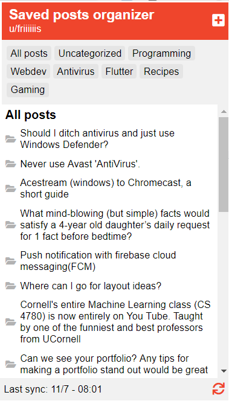
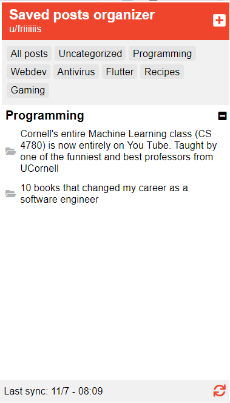
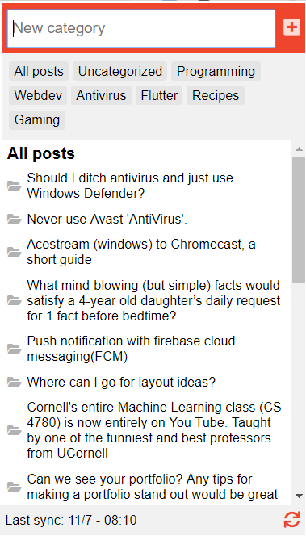
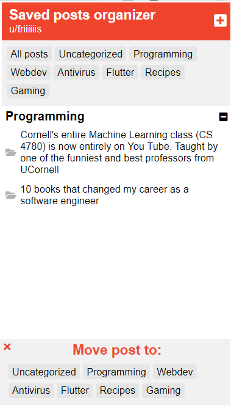
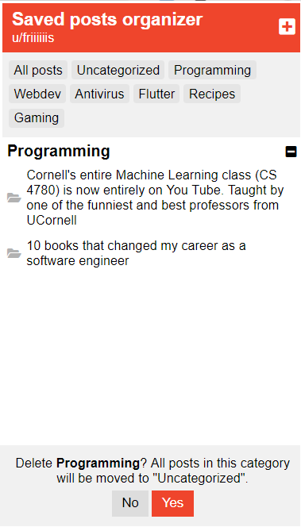

# Saved posts organizer for reddit

This extension loads your saved posts on reddit and lets you organize them in custom folders.

I created this extension because I often save a lot of posts and I needed a way to organize them like I do with bookmarks.

## Download links

### Chrome

[Chrome webstore](https://chrome.google.com/webstore/detail/reddit-saved-posts-organi/bcmoplghilkcbmmnkccgffbofkkdkhnd/)

### Firefox

Coming soon.

## Setup guide

The extension works without any setup as long as you are logged into reddit in your browser. 

## Details

The extension fetches data from your personal feed (https://www.reddit.com/prefs/feeds).

The data will only be saved locally, meaning there is no sync between browsers.

If you log out of your reddit account, all your categories will be saved and all your posts will be organized the same way when you log back in. If you remove the extension from your browser, all categories will be lost and your posts will no longer be organized if you should reinstall the extension later.

Please add an issue if you expirence any bugs.

## Changelog

[Changelog](https://github.com/Friiiis/saved-posts-organizer/blob/master/changelog.md)

## Screenshots

### All saved posts

### Posts inside a category "Programming"

### Add a new category

### Move post to a category

### Delete a category

## Licens 

This software is licensed under GNU General Public License v3.0, also known as [CopyLeft](https://en.wikipedia.org/wiki/Copyleft). This means that anyone is free to copy and reuse this software, as long as the resulting software is also licensed under CopyLeft.
