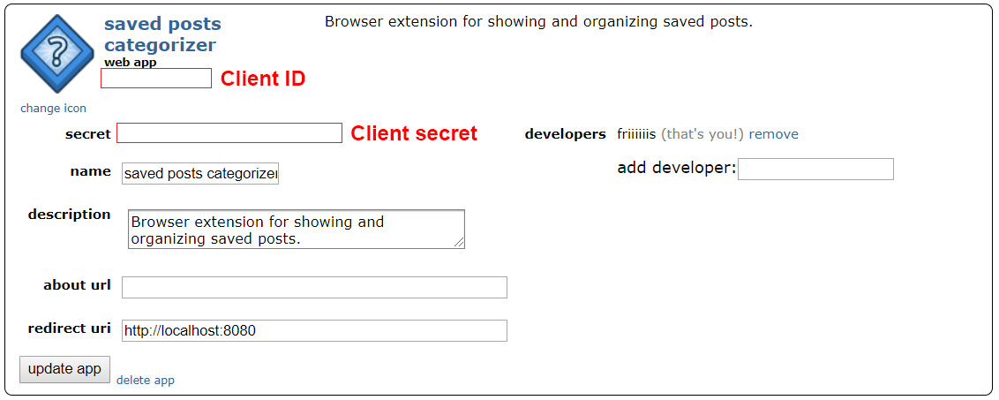
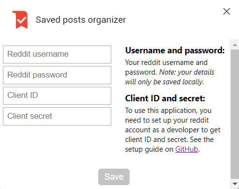

# Saved posts organizer for reddit

This extension loads your saved posts on reddit and lets you organize them in custom folders.

## Setup guide

Unfortunately fetching saved posts from a reddit account is only available when in developer mode. This means that you have to set up your own account as a developer to use this extension ([see the reddit api documentation for more details](https://www.reddit.com/dev/api)). Luckily the setup only takes a few clicks.

### Step 1: install Saved Posts Organizer from Google Web Store
Link:

### Step 2: setup developer account

Navigate to https://old.reddit.com/prefs/apps/

1. Click "are you a developer? create an app..."
2. Fill in the following details:
   - name: "Saved posts organizer - *your username*"
   - choose "script" as the app type
   - description: "Browser extension for showing and organizing my saved posts."
   - redirect uri: "http://localhost:8080"
3. Click "create app"

### Step 3: get client ID and client secret
Your new app details will now be shown on the screen.
Find your client ID and client secret (see image below).

### Step 4: open extension options

To open extension options, navigate to the [Chrome extension page](chrome://extensions/), find Saved posts organizer and click on "Details", and then click on "Extension options".

On this page, add your reddit account details and your client ID and secret. When this is done, hit save, and you're ready to use the plugin.

*Your details will only be stored locally on your browser.*
