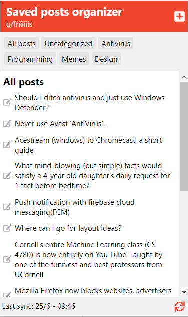
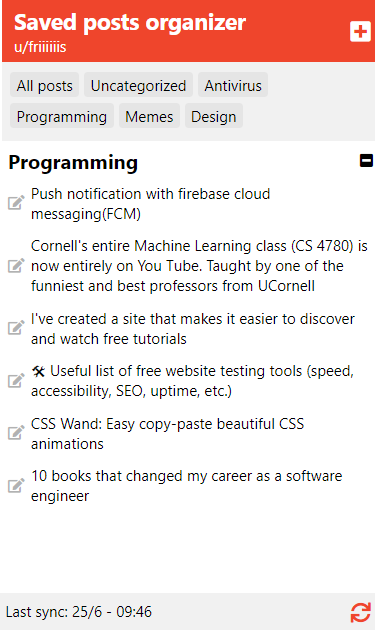
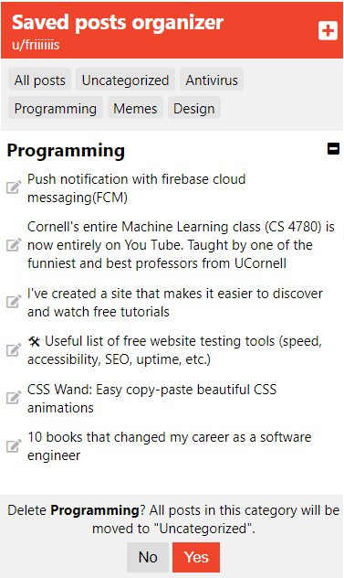

# Saved posts organizer for reddit

This extension loads your saved posts on reddit and lets you organize them in custom folders.

## Setup guide

The extension works without any setup, as long as you are logged into reddit in your browser. 

## Details

The extension fetches data from your personal feed (https://www.reddit.com/prefs/feeds).

The data will only be saved locally, meaning there is no sync between browsers.

Please add an issue if you expirence any bugs.

## Screenshots

### All saved posts

### Posts inside a category "Programming"

### Add new category

### Move post to some category

### Delete category

## Licens 

This software is licensed under [CopyLeft](https://en.wikipedia.org/wiki/Copyleft). This means that anyone is free to copy and reuse this software, as long as the resulting software is also licensed under CopyLeft.
